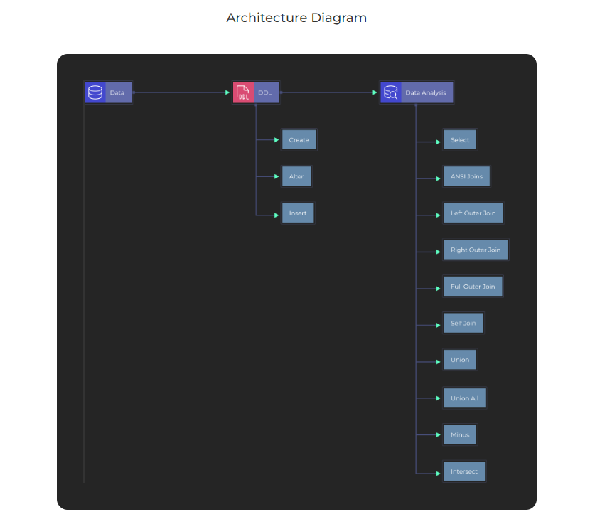

# SQL-Data-Analysis-Part-2
SQL Project for Data Analysis using Oracle Database-Part 2

### Project Description

### What is Dataset Analysis? 
Dataset Analysis is defined as manipulating or processing unstructured or raw data to draw valuable insights and conclusions that will help derive critical decisions that add some business value. The dataset analysis process is followed by organizing the dataset, transforming the dataset, visualizing the dataset, and finally modeling the dataset to derive predictions for solving the business problems, making informed decisions, and effectively planning for the future.

### Oracle SQL Developer :
Oracle SQL Developer is a free IDE that makes it easy to develop and operate Oracle Database in both traditional and cloud environments. SQL Developer is a complete end-to-end development of PL/SQL jobs, worksheets for running queries and scripts,  DBA  for database administration, reporting interfaces and comprehensive data modeling output.

### What is the Agenda of the project? 
This is the second project in the SQL project series, the first project involved the installation of Oracle and the basics of SQL. This project’s Agenda involves Analyzing the data using SQL on the Oracle Database Software. Understanding different types of Joins(Inner join, Left outer join, Right outer join, Full outer join, Self join), different types of Operators(Minus, Union, Union all, Intersect). 

### Tech stack:  
● SQL Programming language

● Oracle SQL Developer

### Dataset Used

Hers is the DDL commands: [DDL.sql](https://github.com/Raghuraj-DataEngineer/SQL-Data-Analysis-Part-2/blob/main/DDL.sql)

Here is the Data Analysis queries:

[Data_Analysis.sql](https://github.com/Raghuraj-DataEngineer/SQL-Data-Analysis-Part-2/blob/main/Data_Analysis.sql)

### Key Takeaways:

● Understanding the project and how to use Oracle SQL Developer

● Understanding the basics of data analysis, SQL commands, and their application

● Understanding the use of Oracle SQL Developer

● Understanding different types of joins.

● Understanding different types of operators.

● Understanding the difference between normal queries and ANSI queries.

● Joining multiple tables.

● Joining multiple tables using ANSI queries.

● Understanding the difference between UNION and UNION ALL operators.

● Understanding the reason behind column ambiguously defined error.

● Resolve the column ambiguously defined error

### Data Analysis:

● Inner Join: display employee details.

● Resolve column ambiguously defined error.

● LEFT OUTER JOIN: List down all the departments along with employees working under it.

● RIGHT OUTER JOIN: List down all the employees along with department details.

● FULL OUTER JOIN: Display all the employee and department records along with missing data.

● SELF JOIN: Display employee details along with manager details.

● UNION and UNION ALL: Combine locations and non functional locations table.

● MINUS and INTERSECT: Find unique and common locations.

● Join multiple tables to fetch employee details.

● Convert previous query to ANSI join query.
